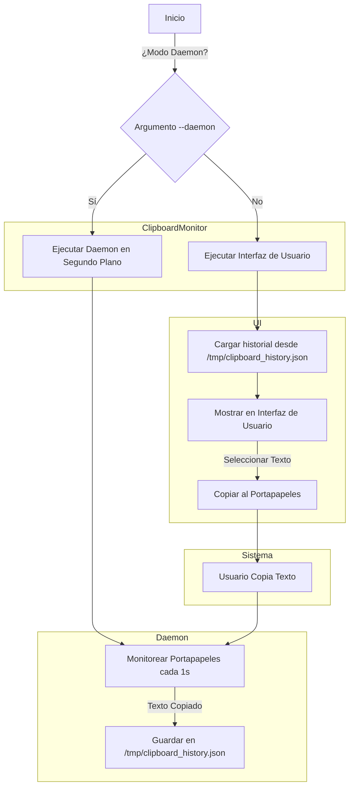

# 📋 Clipboard Monitor

Clipboard Monitor es una aplicación para Linux escrita en **Rust** que monitorea el contenido copiado al portapapeles, almacenando los últimos 10 elementos y permitiendo su reutilización a través de una interfaz gráfica.

### 🔧 Arquitectura del Sistema



### **📌 Explicación del Diagrama**
- **Clipboard Monitor**:
  - **Decide si ejecuta el Daemon o la UI** basado en los argumentos (`--daemon`).
- **Daemon**:
  - Se ejecuta en segundo plano y **monitorea el portapapeles cada segundo**.
  - Guarda los textos copiados en **`/tmp/clipboard_history.json`**.
- **UI**:
  - **Carga el historial** desde el JSON.
  - **Muestra los últimos 10 textos copiados** en la interfaz.
  - Permite **seleccionar un texto** para copiarlo de nuevo al portapapeles.
- **Sistema**:
  - El usuario copia un texto, **el daemon lo captura** y lo guarda.
  - Si el usuario **abre la UI**, se muestra el historial capturado.

## ✨ Características
- Monitorea y almacena automáticamente los últimos 10 textos copiados.
- Interfaz gráfica amigable con soporte de **scroll** para manejar múltiples elementos.
- Trunca textos largos en la vista, pero copia el contenido completo.
- Permite copiar elementos desde la interfaz con un solo clic.
- Empaquetado para instalación en sistemas **.deb** y **.rpm**.

## 🛠️ Dependencias

Este proyecto usa las siguientes dependencias de Rust:

```toml
[dependencies]
efame = "0.22"
egui = "0.22"
arboard = "3.2.0"
cargo-deb = "1.42.0" # Para generar el paquete .deb
cargo-generate-rpm = "0.10.0" # Para generar el paquete .rpm
```

## 🚀 Instalación

### Desde código fuente
1. **Clona el repositorio**
   ```sh
   git clone https://github.com/KDONJS/ClipboardMonitor.git
   cd clipboard-monitor
   ```
2. **Compila y ejecuta**
   ```sh
   cargo run
   ```

### Instalación como paquete `.deb` (Ubuntu/Debian)
```sh
cargo deb
sudo dpkg -i target/debian/clipboard-monitor_1.0.0_amd64.deb
```

### Instalación como paquete `.rpm` (Fedora/CentOS/RHEL)
```sh
cargo generate-rpm
sudo rpm -i target/generate-rpm/clipboard-monitor-1.0.0-1.x86_64.rpm
```

## 📌 Uso
- Ejecuta la aplicación desde el menú de aplicaciones o con:
   ```sh
   clipboard-monitor
   ```
- Copia cualquier texto normalmente (`Ctrl+C` en Linux).
- El texto se almacenará en la aplicación y podrás pegarlo con un solo clic.

## 📝 Licencia
Este proyecto está bajo la **Licencia MIT**. Puedes usarlo, modificarlo y distribuirlo libremente.

---
💡 **¡Contribuciones bienvenidas!** Si quieres mejorar este proyecto, abre un _Pull Request_ o crea un _Issue_. 😃